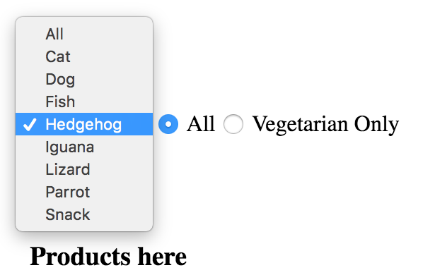
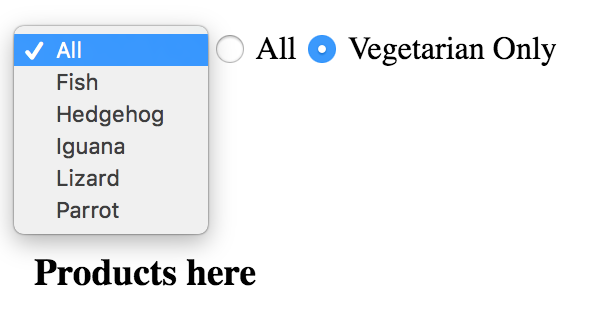

## Pet Shop Assignment Description

### Your assignment is to build an online shop for pets.
 
Task breakdown:
1. Create a view of the shop products that should contain: Name, Price and Pets list.
2. Dropdown controller to Filter the products by pet (See image below).



3. Radio button Controller to Filter products by vegetarian/non vegetarian.
4. If the user chooses vegetarian products the pets list in the dropdown should contains only a vegetarian pets (See image below).



5. Create a header with a cart icon that contains a counter 
   with the number of products added to the cart.  
6. Clicking on a product will redirect to a product view that will contain the following: 
    - Product Image.
    - Pets list that can use this product.
    - Product price.
    - If the product is for Vegetarian pets only.
    - Button “Add To Cart”.
7. Clicking on “Add To Cart” button will open a dialog 
   that asks the user if this product should be added to the cart.
8. Clicking the header cart icon will redirect the user to the cart view.
9. The cart view will contain a list with the products and the total amount, For example:
    ###### 1X ProductA 8.5$
    ###### 2X ProductB 10$
    ###### ---------------
    ###### Total: 28.5$

The Requirements:
1. Angular4 (Angular CLI).
2. Reactive programming (RxJS).
3. Unit testing (Your solution should be fully tested).
4. The code should be modular.
5. Division of responsibility between the code parts.
6. Code Reuse (TS & HTML).
7. Readable Code.
8. Angular material for the view elements.
9. Restful.
10. **Use the existing backend mocks, under "mocks" folder (See the "how to use" example).**

##### Example for "How to use" backend mock

```
import {Injectable} from '@angular/core';
import {Http, Response} from "@angular/http";
import {MockPetsAPI} from "./mocks/mock-pets-api.service";
import {Observable} from "rxjs/Observable";
import 'rxjs/add/operator/map'

@Injectable()
export class PetsApiService {
  public constructor(private http: Http, private mockPetsAPI: MockPetsAPI) {
    this.mockPetsAPI.handleRequest(); // Execute the mock
  }

  private get getBaseUrl(): string {
    return `/pets/`;
  }

  // Get an observable of pets
  public getPets(): Observable<MyType> {
    return this.http.get(this.getBaseUrl).map((response: Response) => {
      const petsList: any = response.json();
      return petsList;
    });
  }
}
```
